
<h1 align="center">社区再就业培训管理系统的设计与实现+jsp</h1>

## 简介
社区再就业培训管理系统：角色分为管理员、再就业人员、老师；功能包括个人中心、考试管理、成绩管理、打卡管理、证书管理、培训项目管理、考勤管理等。    --计算机毕业设计源码；毕设源码；java毕业设计源码

## 联系方式

<h3 align="center">获取完整代码与数据库文件 + 微信：deepguan QQ: 86050149 QQ群: 783742310</h3>

<h3 align="center">可帮忙远程部署 包运行成功！提供远程部署、修改代码、设计文档指导、代码讲解等服务！</h3>

## 功能介绍（完整见运行截图）
管理员：基本功能包括用户登录、注册和管理系统的退出操作，执行再就业培训系统的主要功能管理。补贴管理模块提供再就业人员补贴类型的管理和信息更新。培训项目管理模块负责管理培训项目的创建、修改、删除和查询等操作。此外，管理员能够查看并审核培训项目报名信息并提供审核意见，管理考试和成绩信息的录入和查询，还可维护与证书相关的数据和信息。

再就业人员：用户基本功能包括登录系统和注册新账号，支持根据角色选择登录。再就业人员能够访问个人中心模块，查看并修改个人信息。用户可在培训项目管理模块注册参加培训项目，查看培训项目详情，了解项目类型与相关信息。在考试管理模块中，能够查看个人的考试成绩和参与的考试记录。在证书管理模块中，查看和下载与参与培训相关的证书。

老师：老师的主要功能包括在系统中登录并访问相应的模块进行培训项目的指导。老师在培训项目管理模块中能够查看和管理培训项目的详细信息，包括项目的名称、时间安排和参与人员信息。老师还可以在考试管理模块中录入和更新所负责学生的考试成绩，帮助进行考试信息的组织与管理。在个人中心中，老师可以管理和更新个人资料信息。

系统访客：系统访客可以通过登录或注册成为正式用户，访问系统的基础模块。在登录页选择角色进入系统，并了解社区再就业政策及培训信息，查看部分公开的培训项目和考试信息。在主导航栏管理模块中，访客能够访问首页，查看项目推荐及系统功能概况，以了解所有提供的功能和服务，准备进行系统用户的注册。

## 运行截图
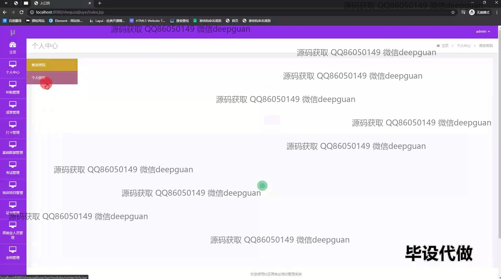
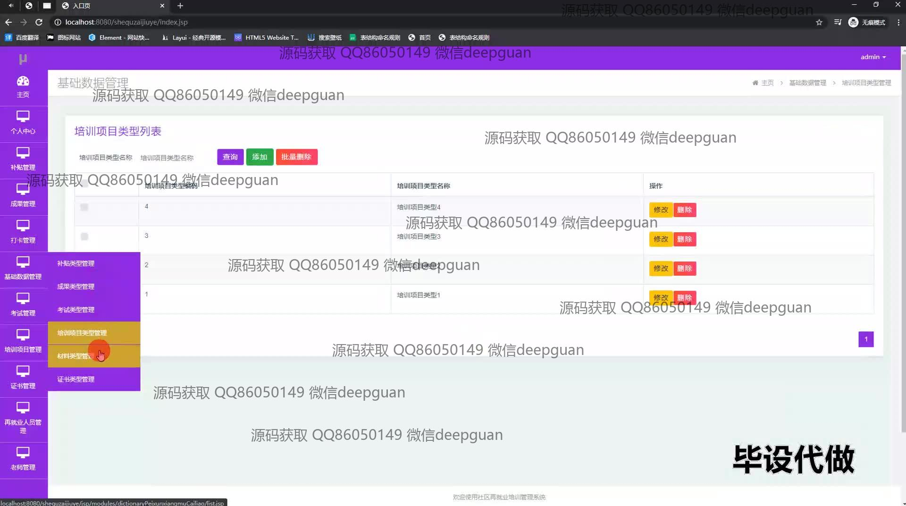
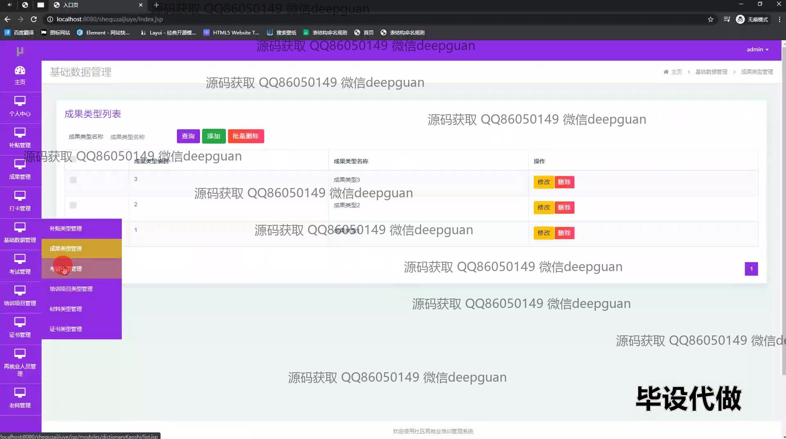
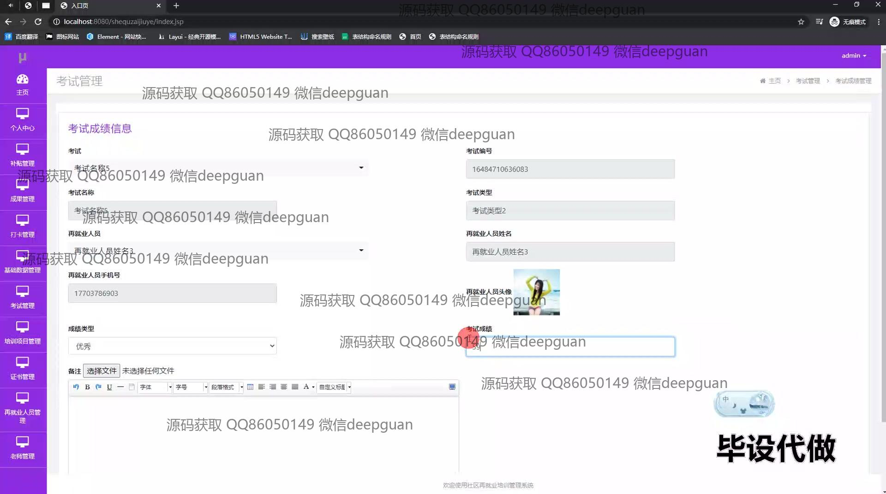
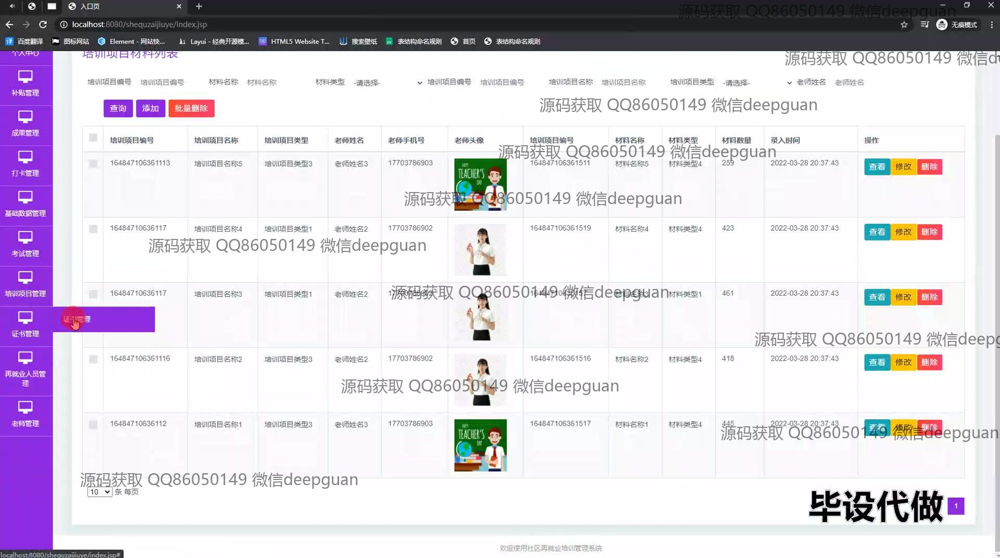
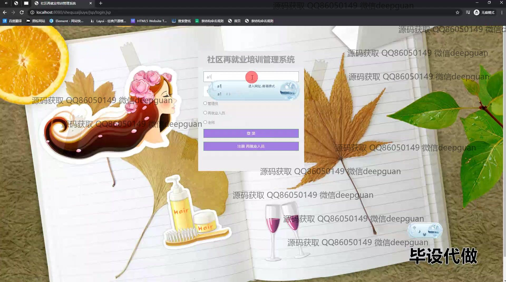
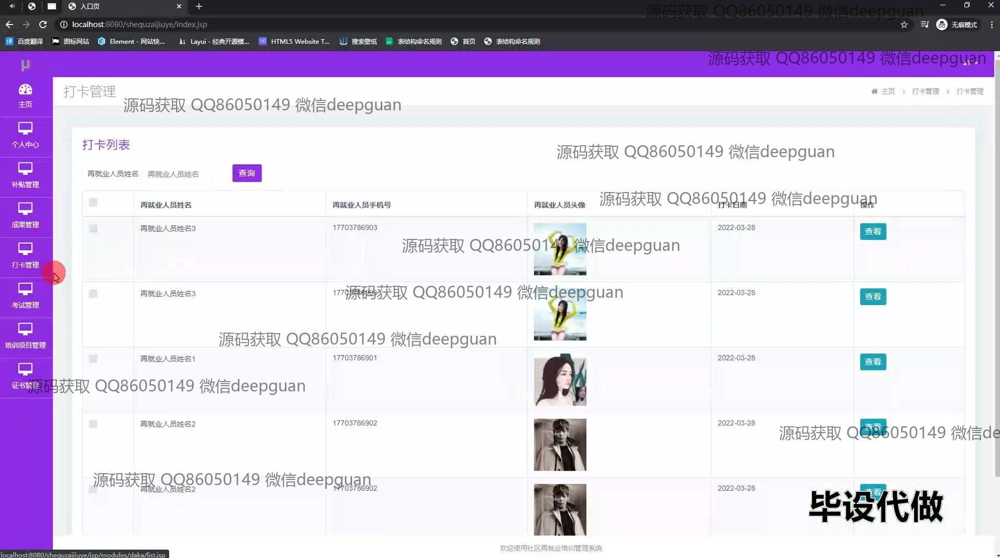
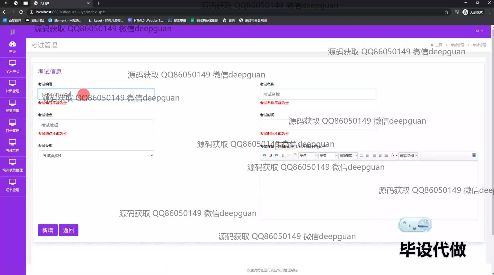
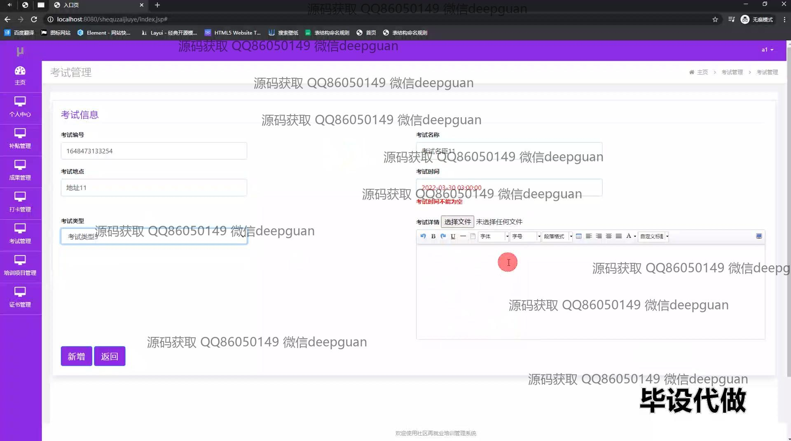

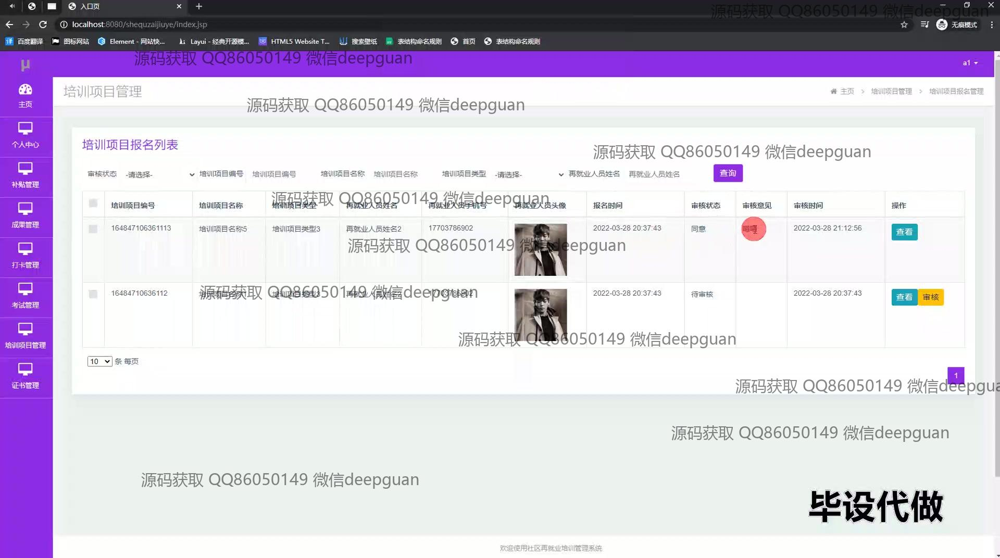
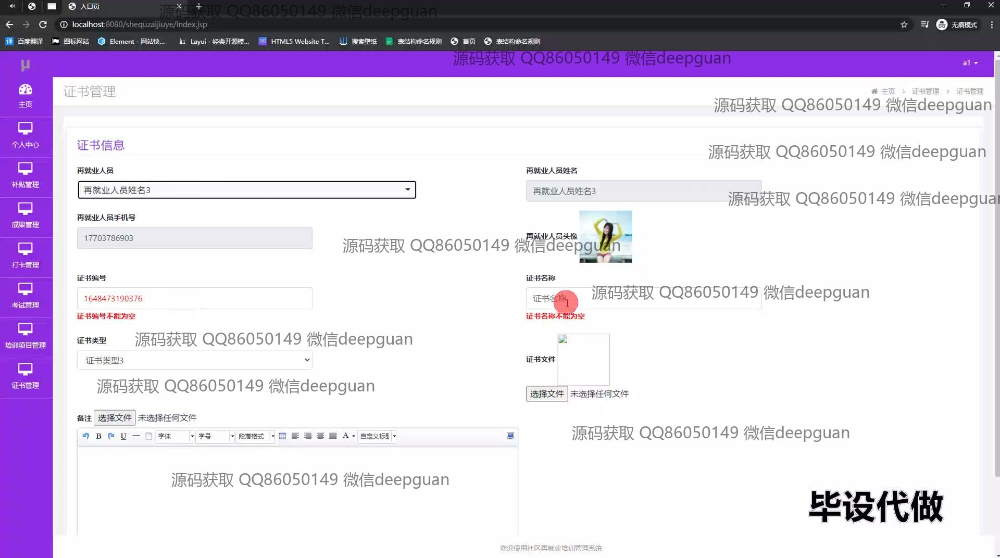
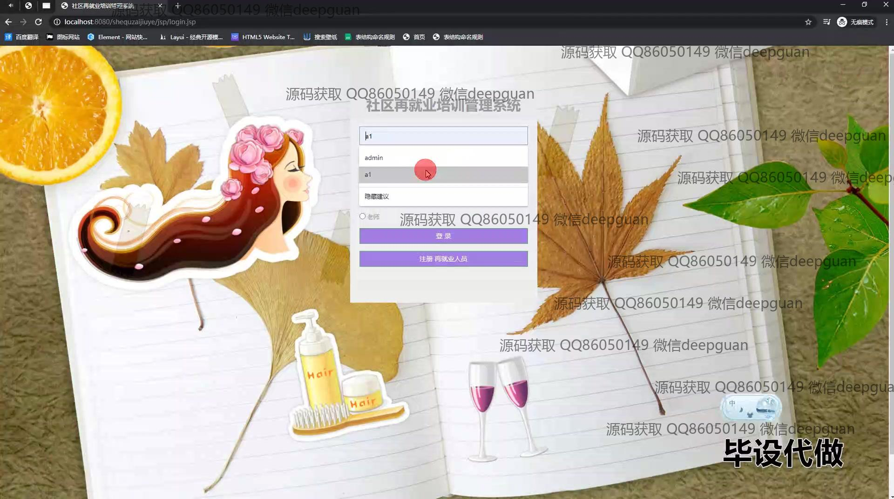
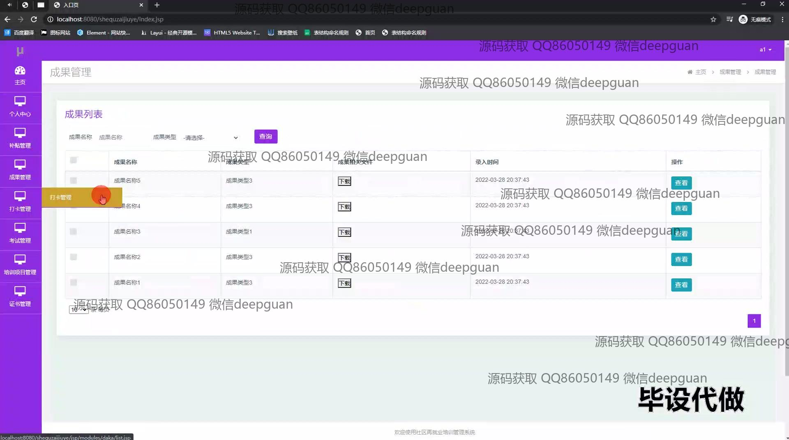
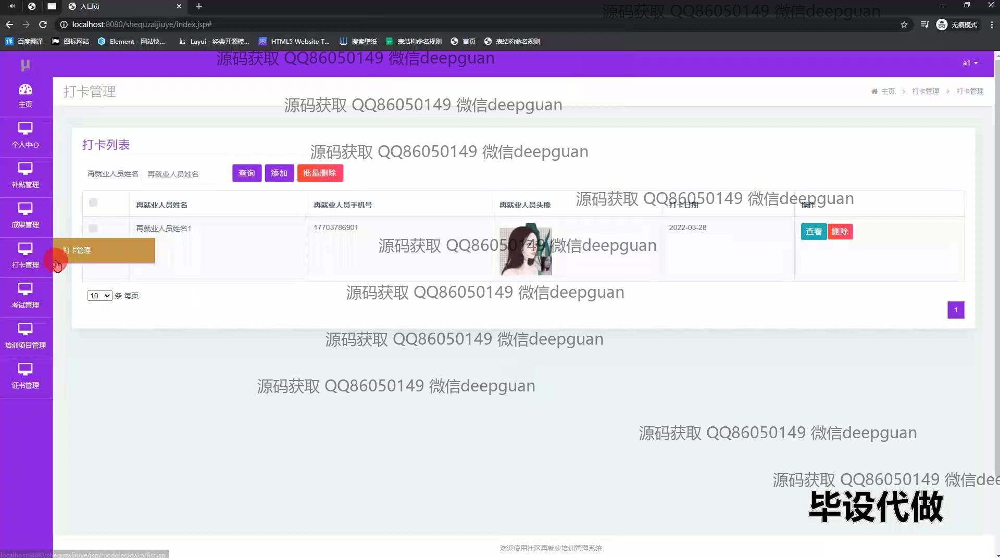
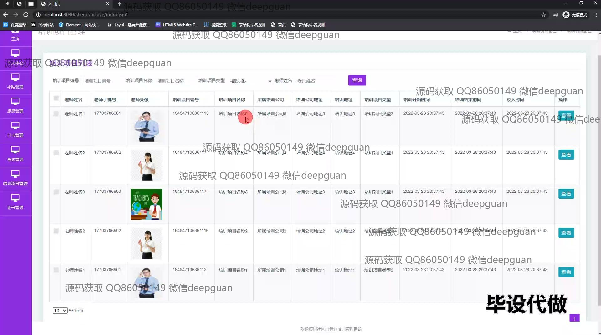
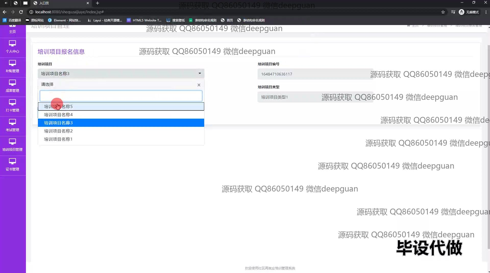

本代码来源于网络,仅供学习参考使用!

